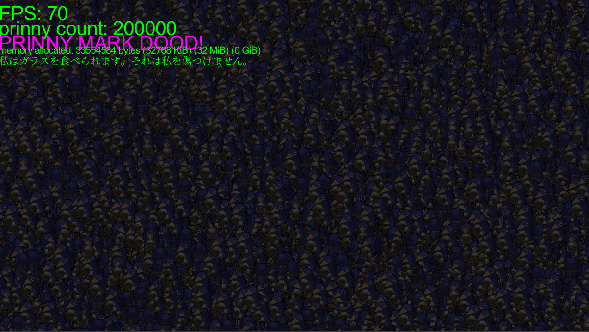
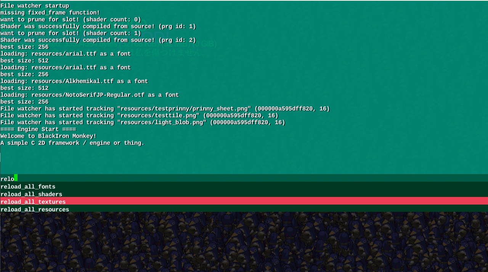

# Blackiron Monkey

A simple C99 game framework that sets up simple shader based sprite rendering.

**NOTE: This project was developed with Mercurial(hg) as source control. So the only files are present!**
**I am aware of hg-git, however I do not wish to use it at the moment.**

## Feature List Summary
- Pure **C99** Codebase
- Performant **OpenGL** based sprite batch renderer
- Flexible build system allowing dynamic or static linking for game code
- Simple exposed APIs to avoid looking at engine code
- **Controller and gamepad** support via XInput
- Targets multiple platforms, and confirmed working on Windows, Linux (Ubuntu), and HTML5
- Fixed-size Unicode **font-cache** allowing for **arbitrary UTF8 text rendering*** with minimal memory usage
- Quake style development console with **autocompletion**
- Simple shader based postprocessing pipeline
- Minimal dependencies (on Windows it does not require any external libraries!)
- **Hot-reloading** of shaders and textures for rapid asset iteration

## Technical Description

This is a small 2D games framework written in C99, and is minimalistic. It's a quickstart with some basic
helper features (as listed above) to make development a little faster. These features include a quake style development
console, and real-time hotreloading of textures and shaders so you can see what your assets look like in-game.

It was intended for gamejam usage, although I haven't had the chance to use it yet, and it has fallen out of
favor for learning Unity and Godot.

It utilizes **OpenGL** to render 2D sprites with a spritebatcher. Sprites may use custom postprocessing shaders,
and there is a simple postprocessing pipeline.

##  Media



## Development / Compiling

### Requirements / Dependencies
- SDL2, SDL2_Mixer: Platform layer libraries, which are used on Linux.
- A _Standard C Linux development environment_: On Windows you should use MinGW-w64 or MSYS2.
- **For Web Deployment**: _Emscripten_ is required to build WebASM targets for this engine.

These requirements should be relatively simple to setup, and are basically avaliable on any Linux system by default.

### Build System

The neat thing is... You don't **need one!**

This project was inspired by the late game engine known as _The Machinery_, which was a modern game engine written
in C99 by the former creators of the _Adobe Stingray_ engine.

I liked many of their ideas, and tried to implement many of them here. As a result this project utilizes techniques
that make it extremely simple to setup and build.

The project utilizes a *unity* build, which means to the compiler this is one translation unit. This means it is very
quick to build as it avoids redundant parsing, and most importantly means to compile for a platform you point the compiler
to a platform main file, and run it.

Compiling is as simple as:

```
gcc platform_win32.c -o engine.exe

... Or any C compiler of your choice! (Unless it's MSVC, which might fail since it has lackluster C support.)
```

**However** this project is a bit different as it is a framework, and is useless without a game! So to make building with
games easier, I have created a custom build system in this engine in C!

### How to use buildtool!

This is the name of the custom build system in this framework. It's a simple program within the repository, and requires
building the bootstrapper.

You can do this by running:
```
gcc build_bootstrapper.c -o build
```

The bootstrapper is responsible for allowing you to build the actual build tool which in turn allows you to build the engine,
and any games that run on it.

The bootstrapper can be used as:
```
build %args
```

The additional arguments will be passed to the build tool. The build tool is generally self explanatory, but for completeness
here is how to use it:

```
build.exe +game %%1 %%...

%%1 is the game entry point, and every other argument afterwards are other translation units.
```

By default it will assume you wish to statically link the engine and the game code. It will produce
a single executable with the game and engine.

If you wish to dynamically link the game and compile the engine separately.

```
build.exe +dynamic +game %%1 %%...

will compile a game into game.dll (you can specify an output with +name before +game), which
you can use to run the game with any engine-only executable.
```

**NOTE: all builds are in debug mode! Add +release to build in release mode!**

## Playing / Running

You can run an engine executable or drag a game dll onto an engine executable.
